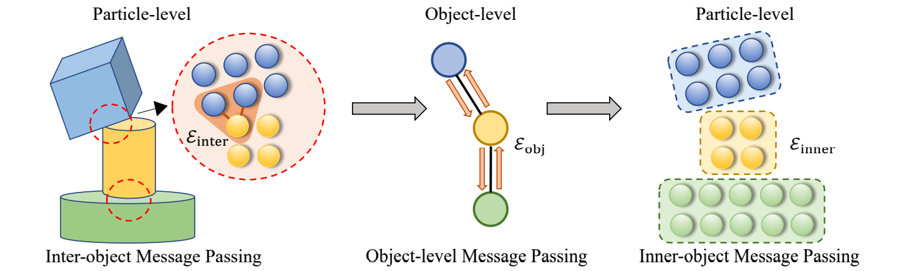
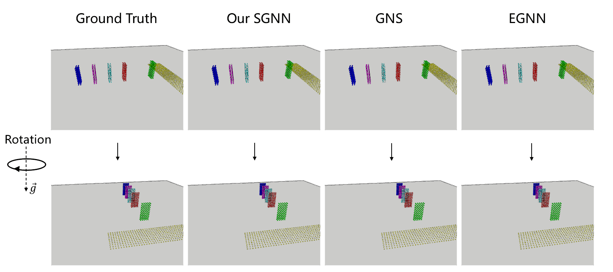

# Learning Physical Dynamics with Subequivariant Graph Neural Networks (NeurIPS 2022)

Jiaqi Han, Wenbing Huang, Hengbo Ma, Jiachen Li, Joshua B. Tenenbaum, Chuang Gan

[](https://github.com/hanjq17/SGNN/blob/main/LICENSE)

[**[Project Page]**](https://hanjq17.github.io/SGNN) [**[Paper]**](https://arxiv.org/pdf/2210.06876.pdf) 

We propose Subequivariant Graph Neural Network (SGNN) that jointly leverages object-aware information as well as subequivariance, a novel concept that relaxes $E(3)$-equivariance constraint in the presence of external fields like gravity. SGNN is demonstrated to perform promisingly in learning physical dynamics on Physion and RigidFall dataset, while being generalizable and data-efficient.





## Dependencies

```
python==3.8
scikit-learn==0.24.2
networkx==2.5.1
torch==1.8.0
torch-geometric==2.0.1
```

These are the basic requirements for running the model of SGNN.

**Acknowledgment**: This repository is developed based on [Physion](https://github.com/htung0101/Physion-particles) and [RigidFall](https://github.com/YunzhuLi/VGPL-Dynamics-Prior). To run the experiments or conduct visualization on these datasets, more packages will be required. Please refer to [Physion](https://github.com/htung0101/Physion-particles) and [RigidFall](https://github.com/YunzhuLi/VGPL-Dynamics-Prior) for more details.

## Data Preparation

#### Physion

We use the official code of [Physion](https://github.com/htung0101/Physion-particles) for the particle-based methods. This official repository contains the detailed guidance of how to retrieve and pre-process the Physion dataset into the desirable format for model training and evaluation.

#### RigidFall

We use the official code of [VGPL](https://github.com/YunzhuLi/VGPL-Dynamics-Prior), which includes instructions of downloading RigidFall and leveraging the data to train and test the model.

## Training and Evaluation

Firstly, make sure the dataset is ready and placed as instructed by the official repositories of Physion or RigidFall. At this time, all placeholders like *YOUR_DATA_DIR* in the code here in this repository should be properly replaced as your data directory for the preprocessed data.

#### Physion

*1. Training.* 

In the Physion directory (`cd Physion`), simply use

```bash
bash scripts/train_sgnn.sh [SCENARIO] [GPU_ID]
```
where [SCENARIO] can be selected from Dominoes, Contain, Link, Drape, Support, Drop, Collide, Roll, and [GPU_ID] is the id of the gpu available, such as 0.

*2. Evaluation.*

```bash
bash scripts/eval_sgnn.sh [SCENARIO] [EPOCH] [ITER] [SCENARIO] [GPU_ID]
```
where [EPOCH] and [ITER] are used to select the checkpoint, and setting them as zeros will automatically select the checkpoint with best validation loss.

*3. Visualization.*

Similar to evaluation, simply run
```bash
bash scripts/vis_sgnn.sh [SCENARIO] [EPOCH] [ITER] [SCENARIO] [GPU_ID]
```

#### RigidFall

*1. Training.*

In the RigidFall directory (`cd RigidFall`), run

```bash
bash scripts/dynamics/train_RigidFall_SGNN.sh
```

*2. Evaluation and visualization.*

```bash
bash scripts/dynamics/eval_RigidFall_SGNN.sh
```

The `--vispy` option in `eval_RigidFall_SGNN.sh` is set to 1 if visualization is needed and 0 otherwise.

## Visualization

An example of the comparison between baselines:


Generalization towards random rotation along the gravity axis:



More visualizations are presented at our [project page](https://hanjq17.github.io/SGNN).

## Citation

If you find our work helpful, please consider citing our work as:

```
@article{han2022learning,
  title={Learning Physical Dynamics with Subequivariant Graph Neural Networks},
  author={Han, Jiaqi and Huang, Wenbing and Ma, Hengbo and Li, Jiachen and Tenenbaum, Joshua B and Gan, Chuang},
  journal={arXiv preprint arXiv:2210.06876},
  year={2022}
}
```

## Contact

If you have any questions, welcome to contact me at:

Jiaqi Han: alexhan99max@gmail.com
